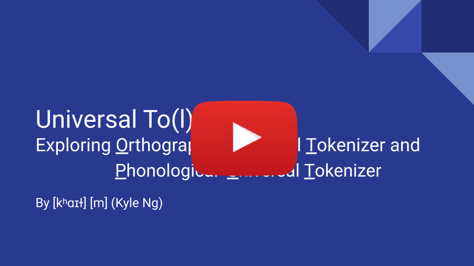
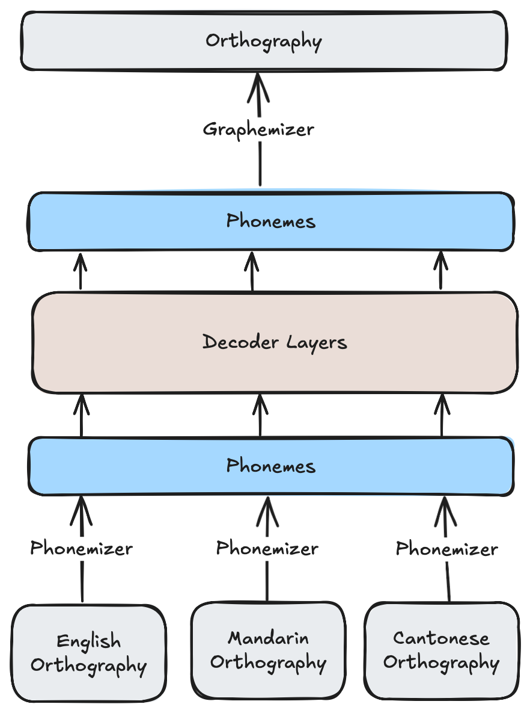
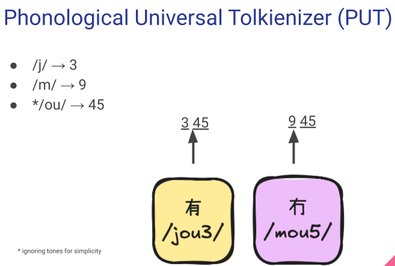
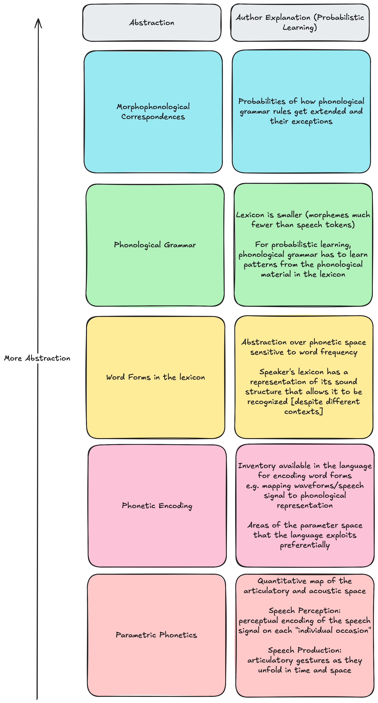

# Universal To(l)k(i)enizer
___
## Overview
> One To(l)k(i)enizer to Rule Them All: Experimenting linguistically-motivated Phonological Universal Tokenizer for Multilingual Efficiency

[](https://youtu.be/0yvCMspM_HY)

### Table of Contents
- [Overview](#overview)
  - [Introduction](#introduction)
  - [Phonological Universal Tokenizer](#phonological-universal-tokenizer)
  - [Repository Motivation](#repository-motivation)
- [Learning List](#learning-list)
  - [New Concepts](#new-concepts)
  - [Papers](#papers)
  - [To Learn](#to-learn)
- [Ongoing Work](#ongoing-work)
  - [Project Roadmap](#project-roadmap)
  - [Train Tokenizer](#train-tokenizer)
  - [Train Tokenizer on Aya Collections](#train-tokenizer-on-aya-collections)

### Acknowledgements
Huge thanks to [Professor Khalil Iskarous](https://dornsife.usc.edu/profile/khalil-iskarous/) for your being my source of inspiration and passion for Computational Linguistics. Thank you [Professor Zuzanna Fuchs](https://www.zuzannazfuchs.com) and [Professor Jason Zevin](https://dornsife.usc.edu/profile/jason-zevin/) for help in understanding the multilingual lexicon.

### Introduction
- Increase `language plasticity`, a model's ability to learn languages post-training for downstream application ("make LLMs life-long language learners")
- Expanding on `One Tokenizer To Rule Them All: Emergent Language Plasticity via Multilingual Tokenizers (Abagyan)` to create a `Phonolgical Universal Tokenizer`
### `Phonological Universal Tokenizer`
- Train `Phonological Universal Tokenizer` on phonemic (International Phonetic Alphabet) transcriptions rather than orthography

- Anticipated Benefits 
	- Training a tokenizer on a high resource neighboring languages could allow cross-lingual transfer to low resourced language even if the two languages do not share the same orthography/vocabulary
		- e.g. Cantonese and Mandarin share many of the same sound; Cantonese has Out of Vocabulary tokens in Mandarin
		- In the example below, Mandarin shares the same phonemes (/m/, /ou/) as Cantonese but does not have the `冇`character in it's orthography. While an orthography-based tokenizer encounter OOV, a phonologically-based tokenizer could handle completely unseen words
		
	- Graceful fallback
		- IPA has ~177 symbols (including diacritics)
		- Since IPA symbols are phonetically transparent and phonemes are shared across languages (e.g. `/a, e, i, o, u/,` vowels shared in many languages; TODO citation) even individual fallback tokens may have well-trained embeddings
- Anticipated Challenges
	- Handling consistent broad phonemic transcription at scale
	- Graphemizer: how to map phonemes back to desired orthography
- Linguistic Motivation
	- Psycholinguistics research on the `lexicon`(mental representation of vocabulary) shows orthography (writing) is converted to phonological units (sound unit mental representations) during processing to activate syntactic/semantic information
		- e.g. [Pierrehumbert "Probabilistic Phonology"](https://www.phon.ox.ac.uk/jpierrehumbert/publications/Pierrehumbert_2003.pdf) model suggests that phonemes (sound units) are processed before attaching meaning
		

### Repository Motivation
The motivation of this repository is to reproduce a minimal scale of the original paper by Cohere Labs to:
1. Deeply understand and learn the methods on creating more efficient universal multilingual tokenizer
2. Collect data on the viability and challenges of the follow-up `Phonolgical Universal Tokenizer`
___
## Learning List
More than just a paper reproduction for collecting results, I found this as a fun opportunity to implement some burning questions, such as "How does BPE work?", who proposed the first "Attention"-like mechanism, and "How to build a transformer in JAX"?
- See [Ongoing Work](#ongoing-work) for more details

### New Concepts
1. Fun Concepts
	1. Learned how to use `vim` (most of the repository is coded using the VsCode `vim` bindings extension); learning through introduction tutorial and AI examples and [Give Me 20 Minutes and I’ll Make You a Vim Motions Expert](https://www.youtube.com/watch?v=z4eA2eC28qg)
	2. Learned Regex (used in `Sennrich et al.`) through [regex101](https://regex101.com)
2. Tokenizer
	1. Byte Pair Encoding (`Sennrich et al.` and `GPT-2` style Unicode tokenization)
	2. Byte-based or `<UNK>` fallback
	3. Weight Tying (Embedding and LM Head share weights; used in this paper)
	4. Language weighting in tokenizer training
### Papers
| Description                                  | Paper Name                                                            | Authors                                        | Link                                                                                                                                                                     |
| -------------------------------------------- | --------------------------------------------------------------------- | ---------------------------------------------- | ------------------------------------------------------------------------------------------------------------------------------------------------------------------------ |
| BPE Paper                                    | Neural Machine Translation of Rare Words with Subword Units           | Rico Sennrich, Barry Haddow, Alexandra Birch   | [arXiv:1508.07909](https://arxiv.org/abs/1508.07909)                                                                                                                     |
| Attention/"soft" search for NMT              | Neural Machine Translation by Jointly Learning to Align and Translate | Dzmitry Bahdanau, Kyunghyun Cho, Yoshua Bengio | [arXiv:1409.0473](https://arxiv.org/abs/1409.0473)<br>• *Wow! This is the first paper to introduce attention; Luong 2015 later uses this more generally in Vaswani 2017* |
| Andrej Karpathy GPT-2 BPE Tutorial (Unicode) | Let's build the GPT Tokenizer                                         | Andrej Karpathy                                | [YouTube](https://youtu.be/zduSFxRajkE?feature=shared)                                                                                                                   |
### To Learn
- [ ] Huffman Encoding
- [ ] JAX Tutorial; relationship between JAX and FAX (mentioned in training methods)
- [ ] Deeply understand
	- [ ] Grouped Query Attention \(Ainslie et al., 2023)
	- [ ] SwiGLU activation function (Shazeer, 2020)
	- [ ] RoPE: Rotary Positional Embeddings (Su et al., 2024)
___
## Ongoing Work
Reproducing the `Abagyan et al.` has many components. The summary below aims to capture the "path to green" in collecting results on a minimal implementation of the `Phonological Universal Tokenizer`.

As each section of the Project Roadmap is finished, a section corresponding to `Project Roadmap` below will be populated
### Project Roadmap
1. \[completed] Reproduce `Sennrich et al.` (original BPE implementation) used in this paper
2. \[in progress] Train minimal tokenizer using subset [Aya Collections (Language Split version)](https://huggingface.co/datasets/CohereLabs/aya_collection_language_split) to reproduce `CLUSTER` and original `UNIVERSAL` tokenizer
3. Create a tiny model (1 to 4 layers) modeling off of the decoder-only Transformer-based architecture detailed in `2.2 Experimental Set-up`
4. Train Phonological Universal Tokenizer and compare performance to `CLUSTER` and `UNIVERSAL`
5. Extra interpretability if time permits: Apply dimensionality reduction (e.g. PCA) to reduce token embeddings to 2D space and look for emergent features (i.e. consonant vs. vowel axis, place/manner of articulation axis, etc.)
### Train Tokenizer
- Tokenizer training based on `Sennrich et al.` using `<UNK>` token for unknown fallbacks
	- Includes all original characters and intermediate merges to encourage generalization in tokenization process
- See [`tokenizer.py`](src/tokenization/tokenizer.py) for implementation and [`test_tokenizer.py`](src/tokenization/tokenizer.py) for usage 
```
python -m src.tokenization.test_tokenizer
```
### Train Tokenizer on Aya Collections
- TODO: Coming Soon!
___
<<<<<<< HEAD
[Back to Top!](#table-of-contents)
=======
[Back to Top!](#table-of-contents)
>>>>>>> 359f35c (add acknowledgements)
